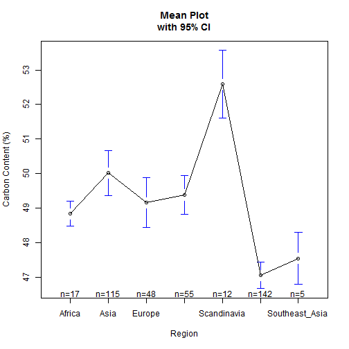

Worldwide Tree Carbon
========================================================


# Analysis by Region
## Regional Plot Means with Error Bars
 


## ANOVA by Region
<!-- html table generated in R 3.0.2 by xtable 1.7-3 package -->
<!-- Mon May 19 13:10:36 2014 -->
<TABLE border=1>
<TR> <TH>  </TH> <TH> Df </TH> <TH> Sum Sq </TH> <TH> Mean Sq </TH> <TH> F value </TH> <TH> Pr(&gt;F) </TH>  </TR>
  <TR> <TD> Region </TD> <TD align="right"> 6 </TD> <TD align="right"> 810.73 </TD> <TD align="right"> 135.12 </TD> <TD align="right"> 19.09 </TD> <TD align="right"> 0.0000 </TD> </TR>
  <TR> <TD> Residuals </TD> <TD align="right"> 387 </TD> <TD align="right"> 2739.39 </TD> <TD align="right"> 7.08 </TD> <TD align="right">  </TD> <TD align="right">  </TD> </TR>
   </TABLE>


## WCD by region
 


# Analysis by Biome
## Anova by Biome

```
## <!-- html table generated in R 3.0.2 by xtable 1.7-3 package -->
## <!-- Mon May 19 13:10:38 2014 -->
## <TABLE border=1>
## <TR> <TH>  </TH> <TH> Df </TH> <TH> Sum Sq </TH> <TH> Mean Sq </TH> <TH> F value </TH> <TH> Pr(&gt;F) </TH>  </TR>
##   <TR> <TD> Biome </TD> <TD align="right"> 2 </TD> <TD align="right"> 685.73 </TD> <TD align="right"> 342.86 </TD> <TD align="right"> 46.80 </TD> <TD align="right"> 0.0000 </TD> </TR>
##   <TR> <TD> Residuals </TD> <TD align="right"> 391 </TD> <TD align="right"> 2864.40 </TD> <TD align="right"> 7.33 </TD> <TD align="right">  </TD> <TD align="right">  </TD> </TR>
##    </TABLE>
```


## Biome Plot Means with Error Bars
 


## WCD by Biome
 


# Analysis by Type
## Anova by Type

```
## <!-- html table generated in R 3.0.2 by xtable 1.7-3 package -->
## <!-- Mon May 19 13:10:38 2014 -->
## <TABLE border=1>
## <TR> <TH>  </TH> <TH> Df </TH> <TH> Sum Sq </TH> <TH> Mean Sq </TH> <TH> F value </TH> <TH> Pr(&gt;F) </TH>  </TR>
##   <TR> <TD> Type </TD> <TD align="right"> 1 </TD> <TD align="right"> 767.45 </TD> <TD align="right"> 767.45 </TD> <TD align="right"> 108.11 </TD> <TD align="right"> 0.0000 </TD> </TR>
##   <TR> <TD> Residuals </TD> <TD align="right"> 392 </TD> <TD align="right"> 2782.67 </TD> <TD align="right"> 7.10 </TD> <TD align="right">  </TD> <TD align="right">  </TD> </TR>
##    </TABLE>
```


## Biome Plot Means with Error Bars
 


## WCD by Biome
 


## Fancy Combinatorial Plots with ggplot2
  

